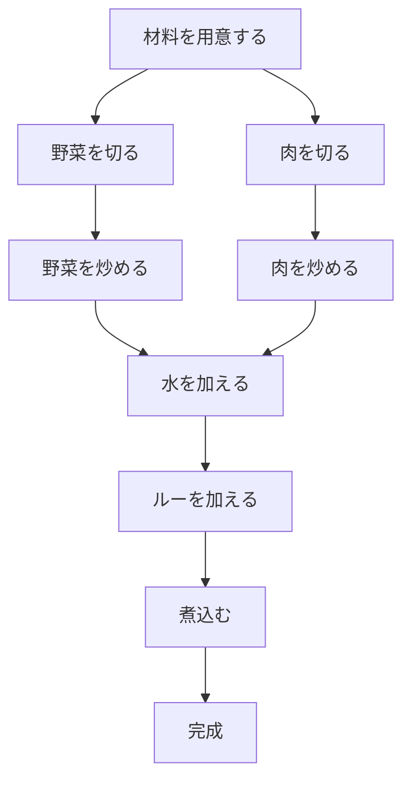

# mermaid
https://dev.classmethod.jp/articles/github-mermaid-markdown-cntrol/

```mermaid
graph TD
    A[材料を用意する]
    B[野菜を切る]
    C[肉を切る]
    D[野菜を炒める]
    E[肉を炒める]
    F[水を加える]
    G[ルーを加える]
    H[煮込む]
    I[完成]
    A --> B
    A --> C
    B --> D
    C --> E
    D --> F
    E --> F
    F --> G
    G --> H
    H --> I
```

> [!NOTE]
> Useful information that users should know, even when skimming content.

